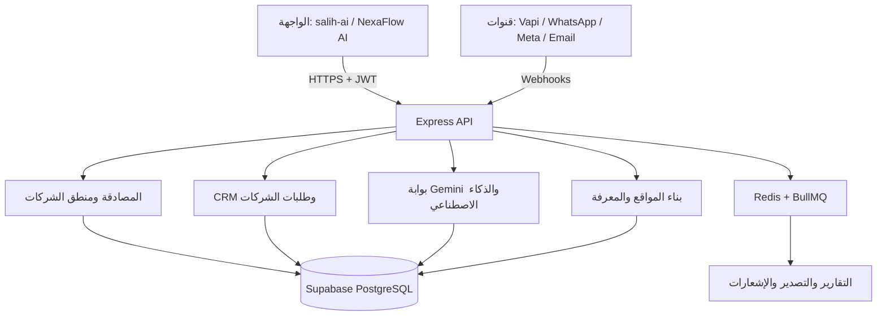

# SALIH AI — Real Estate CRM and AI Voice Platform

SALIH AI هو خادم Node.js/Express لمنصة SaaS متعددة الشركات تدير العملاء المحتملين، المحادثات، المكالمات، وكلاء الذكاء الاصطناعي وطلبات تفعيل الشركات لفرق العقار.

## المعمارية الحالية



نقطة التشغيل الحالية هي `index.js`. وهي تجمع إعداد Express والمسارات والعمال والمجدول في ملف واحد؛ لذلك ستنتقل المكونات تدريجياً إلى `app.js` و`server.js` دون تغيير أي مسار HTTP قائم. خارطة النقل في [docs/refactor-roadmap.md](docs/refactor-roadmap.md).

## المزايا

| المجال | القدرات الحالية |
|---|---|
| الحسابات والشركات | تسجيل الدخول، إنشاء طلب شركة، موافقة/رفض مالك المنصة، وربط الحساب بالشركة المفعلة |
| CRM | العملاء المحتملون، الملاحظات، لوحات البيانات، والقنوات المتعددة |
| الذكاء الاصطناعي | سياق الشركة، ذاكرة العميل، تحليل الصفقات، ووكلاء Gemini |
| المكالمات والقنوات | Vapi وWhatsApp وMeta والبريد الإلكتروني عبر مسارات ويبهوك مستقلة |
| المواقع | توليد وإدارة محتوى وتصميم وميديا ومواقع شركات |
| الخلفية غير المتزامنة | Redis وBullMQ للتقارير اليومية والتصدير والإشعارات |

## التشغيل المحلي

يتطلب المشروع Node.js **20.x** وSupabase وRedis. انسخ ملف البيئة ثم املأ مفاتيحك الخاصة محلياً:

```bash
cp .env.example .env
npm install
npm test
npm start
```

لا تضع أي ملف `.env` أو مفاتيح حقيقية في GitHub. ملف [.env.example](.env.example) يسجل **الأسماء فقط** والقيم فيه أمثلة آمنة.

## متغيرات البيئة

| المتغير | مطلوب | الغرض |
|---|---:|---|
| `SUPABASE_URL` | نعم | عنوان مشروع Supabase |
| `SUPABASE_SECRET_KEY` | نعم | مفتاح خادم Supabase؛ يبقى في الخلفية فقط |
| `JWT_SECRET` | نعم | توقيع رموز الجلسات |
| `PLATFORM_OWNER_EMAIL` | لتوجيه مالك المنصة بالإعداد | تعريف حساب مالك المنصة عند عدم وجود علامة الدور في قاعدة البيانات |
| `REDIS_URL` | للتقارير والمهام | اتصال BullMQ/Redis |
| `GEMINI_API_KEY` | لميزات الذكاء الاصطناعي | اتصال مزود Gemini |
| `SENDGRID_API_KEY` | للبريد | إرسال البريد الإلكتروني |
| `WHATSAPP_API_URL` | لواتساب | واجهة إرسال رسائل القناة |
| `BASE_URL` | للنداءات الداخلية | عنوان الخلفية العام |
| `FRONTEND_URL` | موصى به | أصل الواجهة المسموح به في الإنتاج |

`ALLOW_UNSAFE_TENANT_HEADER` متاح للتطوير المحلي فقط؛ لا تفعله في الإنتاج. لا يقبل الخادم `x-tenant-id` كهوية شركة في الإنتاج.

## الاختبارات

```bash
npm test
```

تغطي الاختبارات الحالية تسجيل الشركة، إنشاء الشركة المؤقتة، ظهور الطلب للمنصة، تفعيل الشركة، توجيه مالك المنصة، توجيه الشركة المفعلة، والتراجع الآمن عند غياب أعمدة اختيارية في المخطط. يوجد اختبار دورة كاملة في `test/companyLifecycle.test.mjs`، واختبار انحدار لعزل الشركة في `test/resolveTenant.test.mjs`.

## الأمان والعزل متعدد الشركات

- يتم تطبيق قرار الدور و`tenant_id` في الخلفية، لا بالاعتماد على إخفاء عناصر الواجهة.
- جميع مفاتيح Supabase وGemini والقنوات تبقى في متغيرات تشغيل الخادم فقط.
- لا تقبل مسارات الويبهوك هوية شركة خام من رأس HTTP في الإنتاج.
- قبل نشر أي تكامل ويبهوك، أضف تحقق توقيع المزود، معالجة تكرار الطلبات، وسياسة مهلة وإعادة محاولة مناسبة.

راجع [تقرير الجاهزية للإنتاج](docs/production-readiness-audit.md) قبل إطلاق إنتاجي عام.

## النشر

تعمل الخلفية على Railway والواجهة الأصلية منشورة على Vercel. يجب ضبط `FRONTEND_URL`/CORS لمصدر الواجهة المنشور، وتعيين جميع مفاتيح الإنتاج من لوحة متغيرات الاستضافة، لا من Git.
