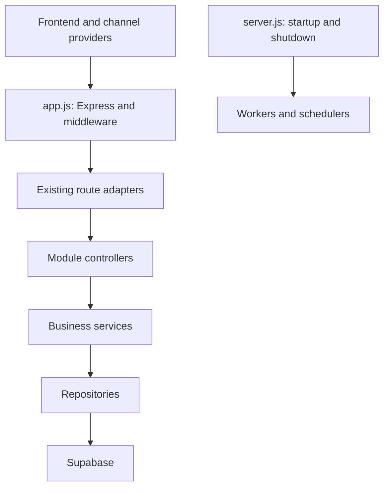

# SALIH AI backend refactor roadmap

## Principles

The current API prefixes and request/response contracts remain stable throughout the migration. New modules are introduced behind the existing routers, then adopted route by route. No database schema is dropped as part of this work.

## Target shape

## Incremental migration order

| Order | Scope | Compatibility rule |
|---|---|---|
| 1 | Shared configuration, authentication middleware, error model and logging | Keep existing route URLs and response fields. |
| 2 | Platform/company activation and login | Move logic behind services already exercised by regression tests. |
| 3 | CRM and AI gateway | Derive tenant identity on the backend; do not trust client-supplied tenant identifiers. |
| 4 | Vapi/Meta/WhatsApp/email webhooks | Add provider signature verification and idempotency before moving route files. |
| 5 | Website ingestion and uploads | Add SSRF protection, MIME/size policies and tenant authorization. |
| 6 | Workers and scheduler | Add job identifiers, retry/backoff policies and graceful shutdown. |

## First completed guardrail

`x-tenant-id` is no longer accepted in production as a fallback identity. It is available only when both `NODE_ENV=development` and `ALLOW_UNSAFE_TENANT_HEADER=true` are set for local development.
